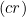
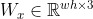

# Building

This project depends on OpenCv. Please install it before building.

Once built, running without a argument provides a blank canvas. Provide path to image file to allow extraction from images.

dolphin.jpg from https://explore.org/livecams/oceans/wild-dolphins

# Diffusion Curves

Diffusion Curves is a vector-based primitive for encoding complex gradients. Traditionally vector based gradients only support linear and radial gradients which is very limiting with the gradients that can be represented.
<p align=center>


<p align=center>
(Left) Linear Gradient (Right) Radial Gradient

Diffusion Curves allows the user to define a vector based line, in this case a set of cubic Bezier curves, and construct a gradient diffusing from the curve.

<p align=center>


<p align=center>


<p align=center>
(Top Left) Bezier Curve (Top Right) Color Curves
<p align=center>
(Bottom Left) Blur Curve (Bottom Right) Final image

Selecting colors on each side of the primary curve is achieved by offsetting the bezier curve by a set amount of pixels, where 3 pixels works well for most resolution.

## Sharp Color Image

First looking at the sharp color image, we formalize the idea of diffusion of colors by minimizing the laplacian of our final image, subject to the constraint of the colors on our color curve. This can be written as


<p align=center>


where  is our final image, and  defined on our color curve storing our colors.

Using the equation in this form can produce the diffusion, however we lose the sharp color change between our color curves

<p align=center>

<p align=center>
Diffusion Curve Without Gradient

To maintain the sharp color along the curve, we define the gradient along the curve in the direction of the curve normal, scaled to the color difference on each side of the curve.

We define
<p align=center>


where 
<p align=center>


having the left side color , right side color , and the normal .

Thus we can updat our equation to include this gradient field as 
<p align=center>


forming a Poisson equation.

To solve this, we first flatten the 2d rasterized color curve image into a 1d array by some form of encoding. Also we can seperate each color channel into a different column. Thus we can write our color curve as a matrix

<p align=center>


>
>### Quick Excerpt on Rasterization
>
>Since bezier curves and color gradients are vectorized forms, we must rasterize them into the matrix $C$.
>
>For simplicity, we will only allow for the use of cubic bezier curve.
>
><p align=center>
>
><p align=center>
>Animation of a cubic Bézier curve, t in [0,1]. <a href="https://en.wikipedia.org/wiki/File:B%C3%A9zier_3_big.gif"> From Wikipedia. </a>
>
>[De Casteljau's algorithm](https://en.wikipedia.org/wiki/De_Casteljau%27s_algorithm) gives us a way of subdividing the bezier curve into two smaller flatter curves of the same order. We can thus keep subdividing the bezier until it is "flat" enough to approximate the segment with a line.
>
>Observe that in the gif above, we can easily compute the two end points of the blue line, and the blue line is always tangent to the bezier curve. Thus, we can rotate this line by  to compute the norm to the curve at any point. In practice, we only need to compute it at the two endpoints and every subdivision points.
>
>Using these norms we can simply offset all endpoints in our line approximation to obtain our offset curves. 
>
>Colors can be simply linearly interpolated on each color channel of the RGB color space to fully color the space.
>
>The lines can be simply plotting using any line plotting algorithm.
>
>When plotting the color curves, we must clear every point between the two curves as when two curves intersect, the intersection leaves nasty artifacts. This can be done by rendering the two lines as a triangle strip and use a simple stensil test to clear the center. Another simpler method is to construct a quadrilateral for each line segment pair, and run flood fill to fill all interior and front/back points
> 
>Norms are plotted on the original line, and can be computed on each end point using the norm and color difference as described above, then linearly interpolated across the line segment.

Similarly we can construct the  and  matricies encoding the  and  components of our color gradient. Stacking these two matricies together yields

<p align=center>


We can solve the Poisson equation by reformulating it as a quadratic minimization problem of the form, as described [here](https://github.com/alecjacobson/geometry-processing-mesh-reconstruction#btw-whats-poisson-got-to-do-with-it), section *BTW, what's Poisson got to do with it?*.

<p align=center>


where  is a discrete divergence matrix. We can write this matrix as 

<p align=center>


where
<p align=center>

<p align=center>


This formula can be expanded to
<p align=center>


This can be solved in libigl using 

    igl::min_quad_with_fixed

Let , known and rgbDense to be  compacted down with known containing the indicies. The solution is obtained by

    igl::min_quad_with_fixed(A, B, known, rgbDense, Aeq, Beq, false, sharpColorImage);

where Aeq and Beq are zero matricies of size  and  since we do not need to use this feature.

<p align=center>

<p align=center>
Sharp Color Curve

## Blur map

We can compute the blur map using the initial equation
<p align=center>


Where  is similarly the rasterized blur curve. Since the blur curve lies directly on our primary curve, we do not need the gradient to keep a sharp line.

Thus solving this equation the same way as described above, but instead having  being a zero vector, yeilds the diffused blur map

<p align=center>

<p align=center>
Blur Map

## Final Image

We can now apply the final blur using the blur map as the pixel wise kernel size using a gaussian blur to yeild our final blurred image.

<p align=center>

<p align=center>
Final Image

## Extraction from Images

It is common for an artist to use a photographic reference as a starting point for their work. This is true in graphic design, where an artist may load an image into a design program and experiment with changes on the image in real-time. Often the stylized artwork is vector-based and uses either flat colour or linear or radial gradients, depending on the style.

### Colour Detection

Diffusion curves offer an effective representation of graphics, and are flexible enough to be stylized in different ways. A diffusion curve is a Bezier curve with offset colour information: artists can draw a curve and have good colour information automatically generated from the underlying image. To colour a diffusion curve, random samples are taken along the Bezier spline. The number of samples is controlled by a sample density parameter that a user can adjust on the fly. At each sample point, traversing the normal vector in both directions will find a colour constraint for the left and right side of the curve.

<p align=center>


<p align=center>
(Left) Sampling on manual curves (Right) Sampling on automatically reconstructed curves

Images can be noisy, and poor placement of edges or normal vectors can result in bad colour samples. To avoid this, colour samples are rejected if the sample pixel is further than one standard deviation from the average of its neighbours. This comparison is made on each channel of an image in LAB space. Doing this improves the quality of colour samples on the diffusion curves.

### Curve Reconstruction

Through analysis of edges, the locations of Bezier curves can be reconstructed from an image as well as their colour constraints. The result is simply a series of diffusion curves, so an artist can continue to edit and stylize their work from that starting point. The number of diffusion curves generated can be controlled by various parameters.

<p align=center>


<p align=center>
(Top-Left) Original image (Top-Right) Diffusion curve representation
<p align=center>
(Bottom-Left) Rendered diffusion curves (Bottom-Right) Rendered diffusion curves using lower edge sensitivity

Like diffusion curves, edges are precisely lines which are different colours on different sides. This means that diffusion curves occur exclusively at edges in an image. Edge detection is a much-studied problem, and this project uses the Canny edge detection algorithm. The output of Canny edge detection is a black-and-white image, which has white pixels at edges and black pixels elsewhere. It can be considered as a matrix, where white colour (or 1) denotes an edge at that location and black (or 0) denotes no edge. The sensitivity of Canny edge detection is controlled by two parameters which can be input into our program and changed interactively.

<p align=center>


<p align=center>
Edges for dolphin image with (Left) low sensitivity and (Right) high sensitivity.
   
After constructing an edge matrix, our program analyzes it to find connected components. A random edge pixel is sampled, and adjacent pixels are explored in a walk. Pixels are collected in a list along the walk. Multiple of these pixel chains can be attached together if two of their endpoints are adjacent, forming longer chains. Representing pixel chains using a list effectively acts as a 1D parametrization of a curve.

The pixel chains are converted to polylines using an approach based on the [Potrace (Polygonal Trace) algorithm](http://potrace.sourceforge.net/potrace.pdf). Each pair of pixels is associated with a penalty, based on the error from using a straight line connecting the two pixels to approximate all the intermediate pixels.

The graph of pairwise penalties can be explored to find a shortest polyline from one end of the pixel chain to the other. Potrace guarantees that the polyline found will have the minimal number of segments, and a lower penalty than any other path with the same number of segments.

Finally, the polylines are converted into Bezier curves. Each point on the polyline becomes a handle, and the slope of the polyline is used to define curve controls on the Bezier curve.

<p align=center>


<p align=center>
(Left) Sparse reconstructed Bezier curves (Right) Dense reconstructed Bezier curves

The result is a series of Bezier curves along the edges of the image. The number of edges can be controlled by the Canny edge detector's upper and lower thresholds: users can manipulate these and experiment with different edge detection settings. Colour sampling can be run to assign colours from the underlying image to curves that follow its edges: the result is a pure diffusion curve representation of the image.

## Design Decisions

This project does not implement all parts of the paper it was based on. For example, image reconstruction does not detect the blurriness of edges and assumes all edges are crisp. The main difficulty of reconstruction was traversing edges and transforming them into Bezier curves: this is where most of the effort in that section was devoted.

Most of the error in curve reconstruction happens at the endpoints of a Bezier curve. If the end is even slightly curved, the last segment of a Bezier curve will be facing away from the body of the curve. The offset colour curves from this point have a noisy, misdirected normal vector and may be very different in angle from nearby points on the curve. This leads to curves perpendicular to an edge and, in the worst case, colour sampling on the wrong side of the edge. Obvious artifacts are produced from these errors. One possible solution would be to manually straighten the endpoints of a curve, or to only accept straight segments at the endpoints that are at least 4 pixels in length.

Our project uses the standard luminance-based image gradient in edge detection, which is different from the paper it was based on. The paper used an advanced image gradient which captured constant-luminance changes. For our project, we found that the more basic gradient was enough to accomplish our goals, and chose to rely on it rather than adding an advanced gradient.

Another form of stylization in the image reconstruction process uses the notion of lifetime, which describes the lightness of an edge. The paper allows an artist to eliminate low-lifetime edges, giving their art a smoother style. We did not include this in this project, because it was apart from the main goal of implementing basic diffusion curves and image reconstruction.

The paper discusses using snakes (active contours) to snap Bezier curves to the edges on an image as the artist draws them. This was seen as unnecessary for our project, which was aimed toward producing minimal results over convenience tools. With careful placement, manual curves can be as accurate as those generated by active contours.


## Running the Program

Our program comes as an executable files. Running this file without arguments will display an empty gray screen. A guide to keyboard inputs will be printed to the terminal.

```
./opengl.exe
```

Clicking on the screen will add handles to a continuous Bezier curve. The handles can be moved and dragged by clicking on them again. Shift-clicking a handle ends the current Bezier curve: the next click will start a new one.

Pressing the C button switches the window to colour mode, in which the colour curves are shown for each diffusion curve. Clicking on any colour handle and pressing E will prompt for input in the running terminal. After entering a 6-digit hex value, the selected handle will become that colour and the colour curve will be updated. Pressing the B key returns to the Bezier curve view.

Pressing the G button switches the window to blur mode. Here a blur curve is shown for diffusion curves in the image. Like in the colour window, clicking on a blur handle and pressing E will prompt for an input. Entering a value will change the amount of Gaussian blur applied to that point in the line.

Pressing the R key will render the diffusion curves, including colour and blur constraints.

If the executable is run with one arguments, taken to be the path to an image file, the window will open with that file as a background. Many image file formats are accepted, include JPEG, PNG, and BMP. The user can draw Bezier curves, select colours and blur values, and render their diffusion curves as usual. However, they also have access to a set of image reconstruction controls.

```
./opengl.exe /path/to/image/file.png
```

Pressing the E key displays edge detection output for the background image. Pressing E again returns to the default view. Pressing the U key will change the upper Canny threshold, and the L key can be used to change the lower Canny threshold. In either case, if the Shift key is held down the value will be increased, otherwise it will be decreased. Changing either of the Canny threshold causes the edge image to be recomputed.

Pressing the S key takes a random sample of points on the current Bezier curves and computes their colours based on the image background. The number of points selected is proportional to a fractional sampling density between 0.05 and 1.0. This value can be changed by pressing the D key; as before, the number will be increased if the Shift key is held down, otherwise it will decrease. Pressing S repeatedly will take more random samples and change the resulting colour assignments.

Pressing the A key will automatically generate Bezier curves at edges in the background image. The density of Bezier curves depends on the settings of the Canny thresholds. Any pre-existing Bezier curves will be deleted when reconstructing from the image. However, the reconstructed curves are still editable.


