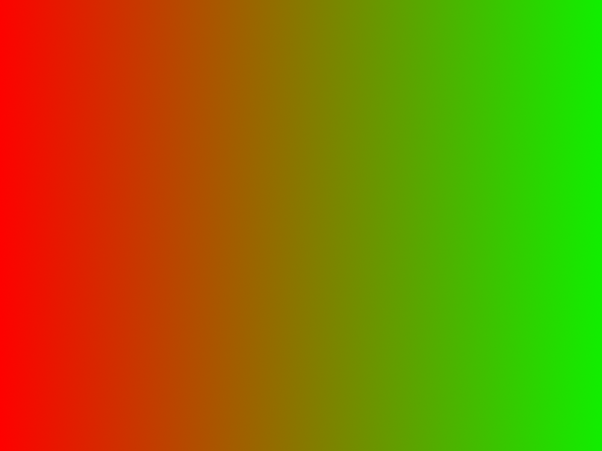
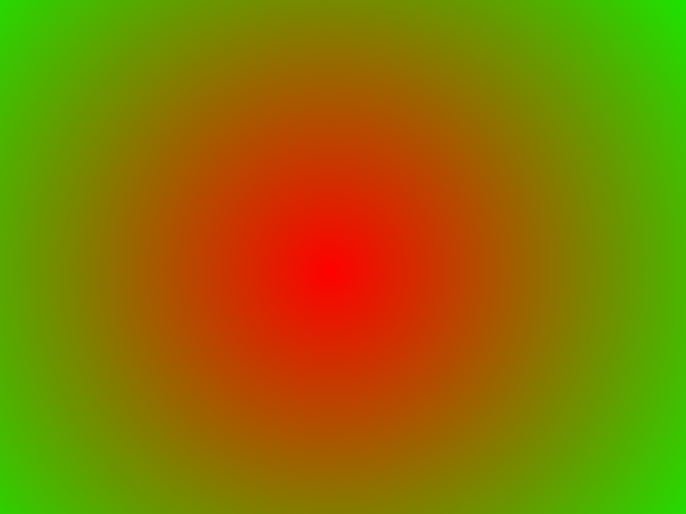
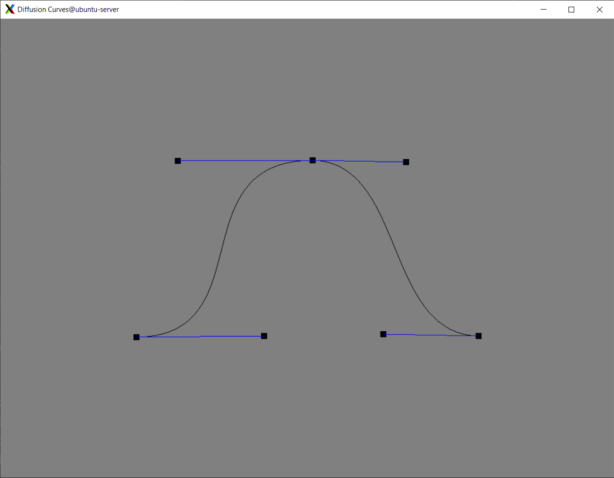
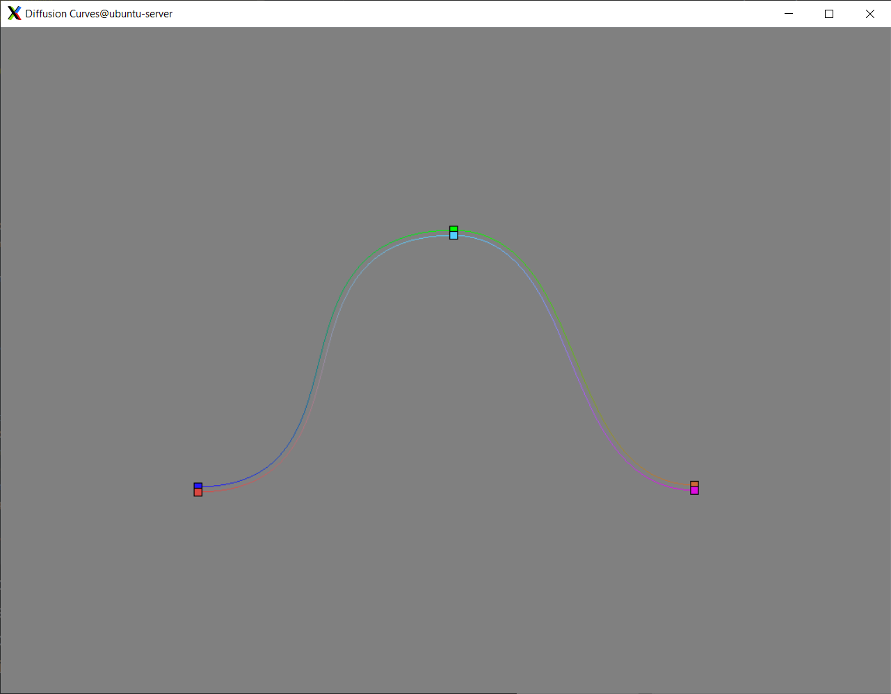
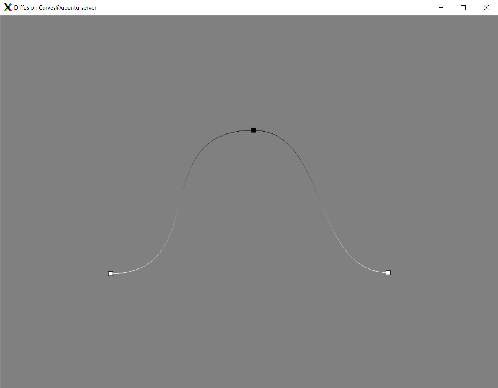
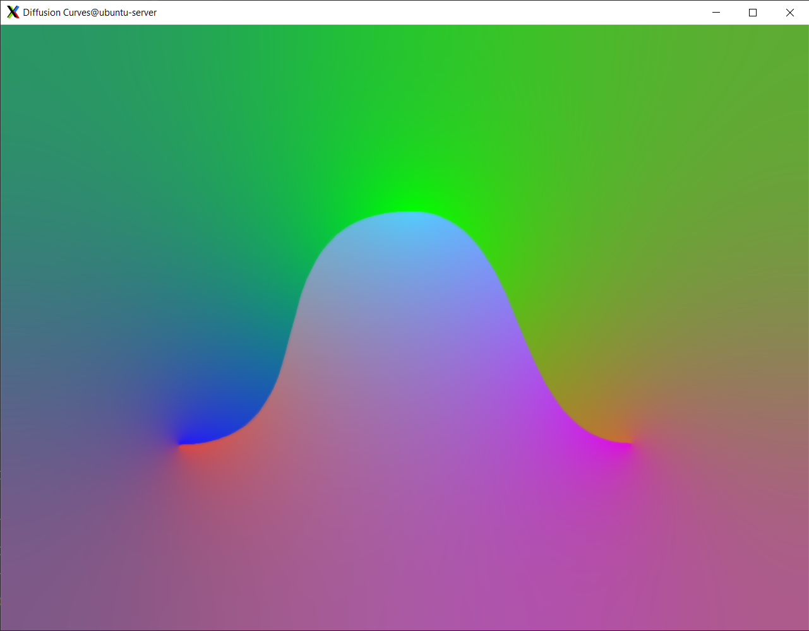
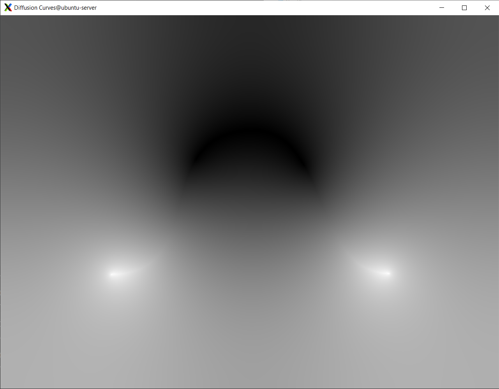

# Diffusion Curves

Diffusion Curves is a vector-based primitive for encoding complex gradients. Traditionally vector based gradients only support linear and radial gradients which is very limiting with the gradients that can be represented.

(Left) Linear Gradient (Right) Radial Gradient

Diffusion Curves allows the user to define a vector based line, in this case a set of cubic Bezier curves, and construct a gradient diffusing from the curve.

(Top Left) Bezier Curve (Top Right) Color Curves

(Bottom Left) Blur Curve (Bottom Right) Final image

Selecting colors on each side of the primary curve is achieved by offsetting the bezier curve by a set amount of pixels, where 3 pixels works well for most resolution.

## Sharp Color Image

First looking at the sharp color image, we formalize the idea of diffusion of colors by minimizing the laplacian of our final image, subject to the constraint of the colors on our color curve. This can be written as

$$\begin{matrix}\Delta I = 0\\I(x, y) = C(x, y)\end{matrix}$$
where $I$ is our final image, and $C$ defined on our color curve storing our colors.

Using the equation in this form can produce the diffusion, however we lose the sharp color change between our color curves

Diffusion Curve Without Gradient

To maintain the sharp color along the curve, we define the gradient along the curve in the direction of the curve normal, scaled to the color difference on each side of the curve.

We define
$$w = (w_x, w_y)$$

where 
$$w_{x, y} = (cl - cr)N_{x, y}$$

having the left side color $(cl)$, right side color $(cr)$, and the normal $N_{x, y}$.

Thus we can updat our equation to include this gradient field as 
$$\begin{matrix}\Delta I = \text{div } w\\
I(x, y) = C(x, y)\end{matrix}$$

forming a Poisson equation.

To solve this, we first flatten the 2d rasterized color curve image into a 1d array by some form of encoding. Also we can seperate each color channel into a different column. Thus we can write our color curve as a matrix

$$C \in \R^{wh \times 3}$$

Similarly we can construct the $W_x \in \R^{wh \times 3}$ and $W_y \in \R^{wh \times 3}$ matricies encoding the $x$ and $y$ components of our color gradient. Stacking these two matricies together yields

$$W = \left(\begin{matrix}
W_{x}\\
W_{y}
\end{matrix}\right)$$

We can solve the Poisson equation by reformulating it as a quadratic minimization problem of the form, as described [here](https://github.com/alecjacobson/geometry-processing-mesh-reconstruction#btw-whats-poisson-got-to-do-with-it), section *BTW, what's Poisson got to do with it?*.

$$\min_{I} \frac{1}{2}||GI-W||^{2}$$

where $G^{T}$ is a discrete divergence matrix. We can write this matrix as 

$G = \left(\begin{matrix}
D_{x}\\
D_{y}
\end{matrix}\right)$,

where
$$D_{x}^{(x, y), (x', y')} = \begin{cases}
    1 & x=x' & y=y'\\
    -1 & x=x'-1 & y=y'\\
    0 & \text{otherwise}
\end{cases}$$
$$D_{y}^{(x, y), (x', y')} = \begin{cases}
    1 & x=x' & y=y'\\
    -1 & x=x' & y=y'-1\\
    0 & \text{otherwise}
\end{cases}$$

This formula can be expanded to
$$\min_{I}\frac{1}{2}I^{T}G^{T}GI-I^{T}G^{T}W+\text{constant}$$

This can be solved in libigl using 

    igl::min_quad_with_fixed

Let $A = G^{T}G$, $B = G^{T}W$, known and rgbDense to be $C$ compacted down with known containing the indicies. The solution is obtained by

    igl::min_quad_with_fixed(A, B, known, rgbDense, Aeq, Beq, false, sharpColorImage);

where Aeq and Beq are zero matricies of size $(0, A.rows())$ and $(0, 0)$ since we do not need to use this feature.

Sharp Color Curve

## Blur map

We can compute the blur map using the initial equation
$$\begin{matrix}\Delta I = 0\\I(x, y) = B(x, y)\end{matrix}$$

Where $B$ is similarly the rasterized blur curve. Since the blur curve lies directly on our primary curve, we do not need the gradient to keep a sharp line.

Thus solving this equation the same way as described above, but instead having $B$ being a zero vector, yeilds the diffused blur map

Blur Map

## Final Image

We can apply the final blur using the blur map as the pixel wise kernel size using a gaussian blur to yeild our final blurred image.

Final Image